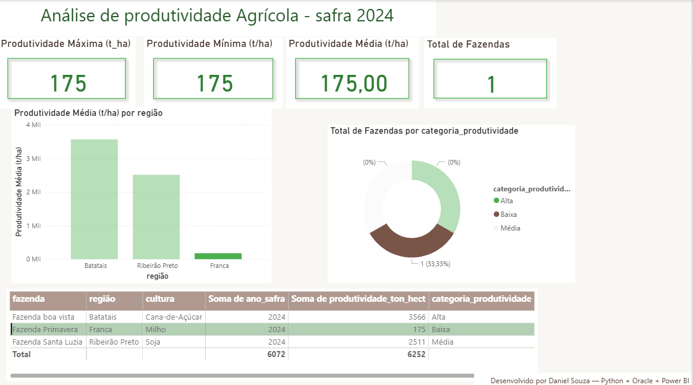

# 🌾 Painel de Indicadores Agrícolas — Oracle + Python + Power BI

> Projeto demonstrativo de análise de produtividade agrícola (ETL: Oracle → Python → Power BI).  
> Objetivo: extrair, tratar e visualizar indicadores operacionais para apoio à tomada de decisão.

---

## 📌 Sumário

- [Sobre o projeto](#-sobre-o-projeto)  
- [Tecnologias](#-tecnologias)  
- [Estrutura do repositório](#-estrutura-do-repositório)  
- [Como executar (local)](#-como-executar-local)  
- [Descrição dos scripts](#-descrição-dos-scripts)  
- [Dashboard (Power BI)](#-dashboard-power-bi)  
- [Melhorias futuras](#-melhorias-futuras)  
- [Licença](#-licença)  
- [Autor](#-autor)

---

## 🌱 Sobre o projeto

Este repositório contém um pipeline simples e reproducível para análise de produtividade agrícola.  
O fluxo principal: **consulta Oracle → extração com Python → tratamento em pandas → exportação para CSV → painel Power BI**.

O propósito é demonstrar habilidades práticas e entrega final aplicável a uma vaga de Analista de Dados Jr.

---

## 🛠️ Tecnologias

- Oracle Database / SQL Developer (scripts SQL)
- Python 3.x (`oracledb`, `pandas`)
- Power BI Desktop
- Git / GitHub

---

  

